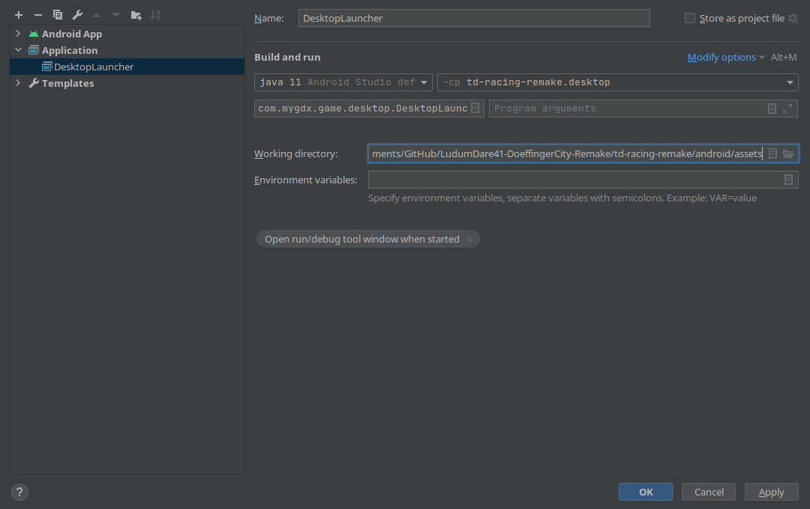

# LudumDare41-DoeffingerCity-Remake

A remake of [LudumDare41-DoeffingerCity](https://github.com/AnonymerNiklasistanonym/LudumDare41-DoeffingerCity)/[itch.io](https://thecze.itch.io/tnt)

Tracks ‘n Towers is a Tower Defense/Racing game.
Zombies are coming for your lovely trailer and you have to defend it to survive.
Finish laps to earn cash to build towers and use your Road Warrior car to mow down hundreds of Zombies.
The faster you finish a lap the more bonus money you will earn!

Go kill some Zombies!

## TODO:

- [x] Get the old project running with Java 8
  - libGDX HTML and Android 6.0 backwards compatibility only allows using some of the Java 8 features
- [ ] Get the project running on Android
  - Touch controls or controller support needs to tested
- [ ] Update Controller implementation to be fun to use
  - It was updated but the tower building integration still needs some work to be more fun
- [ ] Optimize performance and frame rate
  - [ ] Allow more than 60fps (the physics engine currently seems to have some problems with more fps)
- [ ] Add script and test if the project still runs and builds(!) on Windows
- [ ] Update level loader to only load the `levelInfo.csv` file at the start and get all the resources (like how many waves, which map file, ... besides the enemy info) from it and only ever load the current level

## Controls

| Action | Keyboard | XBox 360/One Controller |
| --- | --- | --- |
| Car > Accelerate | `W` / `Up` | Right trigger `RT` |
| Car > Brake | `S` / `Down` | Left trigger `LT` |
| Car > Steer left | `A` / `Left` | Left pad to the left |
| Car > Steer right | `D` / `Right` | Left pad to the right |
| Fullscreen toggle | `F11` | `RB` / `LB` button |
| Exit (in menu), go back or stop bulding a tower | `Escape` | `Back` button |
| Select tower | `1`,`2`,`3`,`4` | Bottom left pad (1=up, 2=right, 3=down, 4=left) |
| Move tower if selected | Move mouse | Right pad |
| Build tower if selected | Left mouse click | `A` button |
| Toggle sounds | `U` | `Y` button |
| Toggle music | `M` | `X` button |
| Toggle pause | `P` | `Start` button |

## Setup

### libGDX project template generation

*(The following part is based on [this article by libgdx](https://libgdx.com/dev/project-generation/))*

To setup the project the *[libGDX PROJECT SETUP](https://libgdx.com/dev/project-generation/)* application was used with the following settings:


### Importing the project into the Android Studio IDE

*(The following part is based on [this article by libgdx](https://libgdx.com/dev/import-and-running/))*

To import the generated project into [Android Studio](https://developer.android.com/studio) (which was chosen to easily test the game for Android devices but can also be extended for desktop testing) you just click `Open File or Project` and select the directory that was specified in the `Destination` text field during the libGDX project setup.

To easily test this application run configurations can be added:

Per default an `android` run configuration is already there which runs out of the box which can be run by clicking the green triangle (emulator or local Android device is both possible). When clicking on the entry select `Edit Configurations`, then click the plus symbol (`Add New Configuration`) and select `Application`. Give it the name `DesktopLauncher` and select an Android version, the desktop main class and append to the working directory `android/assets` so that resources in this directory can be found.



After clicking `OK` you should be able to press the green triangle while having the `DesktopLauncher` run configuration selected and a native desktop build should be compiled and run which means you are ready to build and test the game for desktop and Android devices.

These configurations need to be done each time this repository is cloned because every device will most likely have different parameters/paths.

### Export and run the project via the command line

To build, run and export the project using the command line you use `gradle`.

For ease of use (on Linux) you can create a [`Makefile`](td-racing-remake/Makefile) that contains multiple targets for each use case:

```makefile
.PHONY: clean clean_desktop clean_html build_desktop build_html

VERSION=1.0

all: export_desktop export_html

clean: clean_desktop clean_html

clean_desktop:
	# Run the gradle command to clean the desktop build files
	./gradlew desktop:clean
	# Remove the created JAR file
	rm -f bin/desktop-$(VERSION).jar

clean_html:
	# Run the gradle command to clean the html build files
	./gradlew html:clean
	# Remove the created HTML directory
	rm -rf bin/html-$(VERSION)

build_desktop:
	# Run the gradle command to build the desktop exectuable (JAR file)
	./gradlew desktop:dist

build_html:
	# Run the gradle command to build the html directory (can be hosted)
	./gradlew html:dist

export_desktop: build_desktop
	# After building desktop copy the created jar into a new bin directory
	mkdir -p bin
	cp desktop/build/libs/desktop-$(VERSION).jar bin/desktop-$(VERSION).jar

export_html: build_html
	# After building html copy the created directory into a new bin directory
	mkdir -p bin
	cp -R html/build/dist bin/html-$(VERSION)
```

You can either just run the command `make` in the directory to export a desktop and HTML version into a new `bin` directory or run `make TARGET` to only run a specific command (like for example `make clean` to clean all build files or `make export_desktop` to only export a desktop executable).

**Infos to changes that were custom made:**

- The whole project was tried to be run with the latest gradle and JAVA versions but with gradle 7+ onwards there were problems which is why the latest previous version of gradle is used and with JAVA versions above 8 there were problems too (the html sub project) which is why all mentions in `build.gradle` files were updated from `1_7` to only `1_8`
- To get a release `.apk` file you need to update the `android.buildTypes` section in [`android/build.gradle`](td-racing-remake/android/build.gradle) to list a debug and release configuration where the release configuration has an additional `signingConfig` entry:

  ```gradle
    buildTypes {
        debug {
            minifyEnabled true
            proguardFiles getDefaultProguardFile('proguard-android.txt'), 'proguard-rules.pro'
        }
        release {
            minifyEnabled true
            proguardFiles getDefaultProguardFile('proguard-android.txt'), 'proguard-rules.pro'
            signingConfig signingConfigs.release
        }
    }
  ```
  
  Then you can add an `android.signingConfigs` section in which you either manually enter all the paths (not recommended) or replace them with system environment variables so that you can locally define the paths and keep them a secret which also means multiple configurations can exist on multiple devices without any code changes:

  ```gradle
    signingConfigs {
        release {
            storeFile file("$System.env.KEY_STORE_PATH")
            storePassword = "$System.env.KEY_STORE_PASSWORD"
            keyAlias = "$System.env.KEY_ALIAS"
            keyPassword = "$System.env.KEY_ALIAS_PASSWORD"
        }
    }
  ```
  
  You can now for example have a shell script somewhere with these environment variables (or save them as secret on your CI/CD platform) and just source (`source keyinfo.sh && ./gradlew android:assembleRelease`) this script before creating the android file:
  
  ```sh
  export KEY_STORE_PATH="/your/key/store/path.jks"
  export KEY_STORE_PASSWORD="YourKeyStorePassword"
  export KEY_ALIAS="YourKeyName"
  export KEY_ALIAS_PASSWORD="YourKeyPassword"
  ```
  
  Here for example 2 new targets for the `Makefile` to easily automize this process:
  
  ```Makefile
  build_android:
	# I recommend saving the following necessary variables in a shell file as
	# environment variables and the sourcing this file before executing this target
	# [Because of the singing step this is excluded from the default make call]
	@echo "----------------------------------------------------------------------------"
	@echo "You need to set the following environment variables to sign the APK:"
	@echo "KEY_STORE_PATH=$(KEY_STORE_PATH)"
	@echo "KEY_STORE_PASSWORD=$(KEY_STORE_PASSWORD)"
	@echo "KEY_ALIAS=$(KEY_ALIAS)"
	@echo "KEY_ALIAS_PASSWORD=$(KEY_ALIAS_PASSWORD)"
	@echo "----------------------------------------------------------------------------"
	# Run the gradle command to build a signed executable (APK file)
	./gradlew android:assembleRelease

  build_android_debug:
	# Run the gradle command to build a debug executable (APK file)
	./gradlew android:assembleDebug
  ```
  
- To create a custom Android Icon you open Android Studio in the `Android` perspective and make a right click on the `android/res` directory, then click `New`, `Image Asset` and create one - after that it could be that you need to edit the [`android/manifest/AndroidManifest.xml`](td-racing-remake/android/AndroidManifest.xml) file to update the line `android:icon="@drawable/ic_launcher"` with `@mipmap` (The name of the app can be changed by updating the [`android/values/strings.xml`](td-racing-remake/android/res/values/strings.xml) file)
  
### Run the exported files

**Linux:**

- To run the created `.jar` file either double click it or type in the terminal:

  ```sh
  cd bin
  java -jar NameOfTheJar.jar
  ```

  ---

  If you get any problems try running it with Java version 8. You can do this for example by directly calling it:

  ```sh
  # java -jar desktop.jar
  # WARNING: An illegal reflective access operation has occurred
  # WARNING: Illegal reflective access by org.lwjgl.LWJGLUtil$3
  # [....]
  /usr/lib/jvm/java-8-openjdk/bin/java -jar bin/desktop-1.0.jar
  # Now the error should be gone but it could be that you need to recompile the project:
  make clean dist_desktop
  ```

  Or when you are on an Arch Linux based distribution you should be able to run the following to temporarily change the Java version to 8:

  ```sh
  sudo archlinux-java set java-8-openjdk
  ```

  ----

- To run the web app you can create a local web server in the terminal:

  ```sh
  # The following command only works if you have Python of version 3 or greater installed!
  cd bin
  python -m http.server
  # Now click or copy the listed URL to open it in your browser
  # (most likely http://0.0.0.0:8000/) and append the name of the html directory
  # (for example http://0.0.0.0:8000/html-1.0/) to view it in your browser.
  ```

## Used Software

- Originally the Java (6 because of libGDX at the time) code was written and debugged using [Eclipse Java Oxygen](https://www.eclipse.org/oxygen/) 
- To create the bounding maps for the box2D physics the [box2d-editor](https://code.google.com/archive/p/box2d-editor/downloads) was used
- To create the Bitmap fonts the program [Hiero](https://libgdx.badlogicgames.com/tools.html) was used
